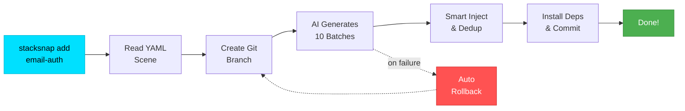
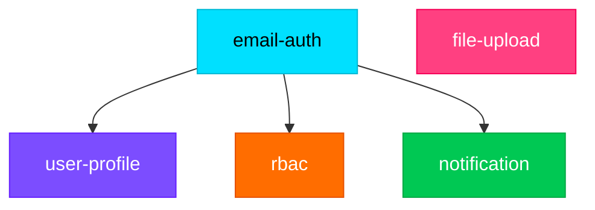

<div align="center">


<br/>


<br/><br/>

[](https://www.npmjs.com/package/create-ai-stack)
[](https://opensource.org/licenses/MIT)
[](https://nodejs.org)
[](https://www.typescriptlang.org)
[]()
[](https://github.com/Sfrui/stacksnap/stargazers)
[](https://github.com/Sfrui/stacksnap/commits)

<br/>


</div>

---

## What is StackSnap?

StackSnap is an AI-powered CLI tool that reads predefined **scene definitions** (YAML files describing full-stack features like authentication or user profiles), uses an **OpenAI-compatible API** to generate backend models, services, API routes, frontend pages, components, hooks, and TypeScript types, then **safely injects** the generated code into your existing project with automatic Git branching and rollback on failure.

<div align="center">



</div>

```bash
$ stacksnap add email-auth

Using scene: email-auth
Created branch: stacksnap/email-auth
- Generating code with AI... (10 batches)
- Generated 12 file(s)
- Injecting files...
  Created: src/services/authService.js, src/routes/auth.js, ...
  Modified: prisma/schema.prisma, src/routes/index.js, ...
- Installing dependencies...
  bcryptjs, jsonwebtoken, nodemailer, zod
- Changes committed.

Scene "email-auth" added successfully!
```

---

## Quick Start

### Install

```bash
npm install -g create-ai-stack
```

Or use directly:

```bash
npx create-ai-stack init
```

### Configure AI Provider

StackSnap supports any OpenAI-compatible API:

```bash
# OpenAI
export OPENAI_API_KEY="sk-your-key"

# Custom provider (e.g. DeepSeek, SiliconFlow, etc.)
export OPENAI_API_KEY="your-key"
export OPENAI_BASE_URL="https://your-api-endpoint/v1"
export OPENAI_MODEL="your-model-name"
```

> On Windows PowerShell: `$env:OPENAI_API_KEY="your-key"`

### Initialize & Add

```bash
# Detect project config (framework, ORM, package manager)
stacksnap init

# Add a full-stack scene (interactive selection)
stacksnap add

# Add a specific scene directly
stacksnap add email-auth
```

---

## How It Works

```
stacksnap init                stacksnap add email-auth
     |                              |
     v                              v
 Detect project                Load scene YAML
 framework, ORM,               + check dependencies
 package manager                    |
     |                              v
     v                        Create Git branch
 .stacksnap.json               stacksnap/email-auth
                                    |
                                    v
                              AI generates code in 10 batches
                              (models, index, services, routes,
                               API modules, types, pages, hooks,
                               components, router registration)
                                    |
                                    v
                              User confirms file list
                                    |
                                    v
                              Smart file injection
                              (new files, deduplication, merge)
                                    |
                                    v
                              Install dependencies
                              Git commit
                                    |
                              (auto-rollback on failure)
```

---

## AI Code Generation Pipeline

When you run `stacksnap add`, StackSnap executes a **10-batch sequential generation pipeline**:

| Batch | Output | Description |
|:-----:|--------|-------------|
| 1 | Backend Models | Prisma schema models, Sequelize model files, or Drizzle table definitions |
| 2 | Model Index | Multi-file ORM index registration (Sequelize/Drizzle, skipped for Prisma) |
| 3 | Backend Services | Service layer with business logic functions |
| 4 | Backend Routes | API route handlers + route registration block |
| 5 | Frontend API | Frontend API request modules (skipped for Next.js) |
| 6 | Type Definitions | TypeScript interfaces and types |
| 7 | Frontend Pages | Vue 3 SFCs / React components / Next.js pages |
| 8 | Frontend Hooks | Composables / custom hooks |
| 9 | Frontend Components | Reusable UI components |
| 10 | Router Registration | Frontend route configuration (skipped for Next.js) |

Each batch uses AI prompts that include:
- Role-specific instructions (e.g. "You are a Prisma schema expert")
- Reference files from your project (for code style matching)
- Previously generated code from earlier batches (for consistency)
- Existing StackSnap code (to avoid duplicates across multiple scene additions)

---

## Available Scenes

<table>
<tr>
<td width="50%">

### email-auth

Full email-based authentication system:

- **Dependencies:** bcryptjs, jsonwebtoken, nodemailer, zod
- **Models:** User (email, password, name, avatar, emailVerified), VerificationToken (purpose-aware)
- **API:** register, login, logout, forgot-password, reset-password, verify-email, me, change-password, refresh-token
- **Pages:** login, register, forgot-password, reset-password, verify-email
- **Components:** LoginForm, RegisterForm, ForgotPasswordForm, ResetPasswordForm, AuthGuard
- **Hooks:** useAuth, useRequireAuth
- **Types:** auth (User, LoginInput, RegisterInput, AuthResponse, ResetPasswordInput)

</td>
<td width="50%">

### user-profile

User profile management:

- **Dependencies:** zod
- **Models:** reuses existing User (from email-auth)
- **API:** GET/PUT /api/user/profile
- **Pages:** profile view & edit
- **Components:** ProfileForm
- **Hooks:** useProfile
- **Types:** user-profile (UserProfile, UpdateProfileInput)
- **Requires:** `email-auth` scene

</td>
</tr>
<tr>
<td width="50%">

### rbac

Role-based access control:

- **Dependencies:** zod
- **Models:** Role, Permission, RolePermission (with unique constraint), UserRole (with unique constraint)
- **API:** role CRUD, permission assignment, user-role management, permission query
- **Pages:** role management, permission overview
- **Components:** RoleForm, PermissionTree, RoleSelect
- **Hooks:** usePermissions, useRoles
- **Types:** rbac (Role, Permission, CreateRoleInput, AssignPermissionsInput)
- **Requires:** `email-auth` scene

</td>
<td width="50%">

### file-upload

File upload and management:

- **Dependencies:** multer, zod
- **Models:** FileRecord (name, type, size, path, url)
- **API:** upload, multi-upload, file list, detail, delete, download
- **Pages:** file management (grid/table view)
- **Components:** FileUploader, FilePreview, FileSelect
- **Hooks:** useFileUpload, useFileList
- **Types:** file-upload (FileRecord, UploadResponse, FileListQuery)
- **Note:** Express only (Next.js uses native Request.formData())

</td>
</tr>
<tr>
<td width="50%">

### notification

In-app notification system:

- **Dependencies:** zod
- **Models:** Notification (type, title, content, link, isRead)
- **API:** notification list, unread count, mark read, mark all read, delete, delete all
- **Pages:** notification list (all/unread tabs)
- **Components:** NotificationBell, NotificationItem, NotificationDropdown
- **Hooks:** useNotifications, useUnreadCount
- **Types:** notification (Notification, NotificationType, NotificationListQuery, UnreadCountResponse)
- **Requires:** `email-auth` scene

</td>
<td width="50%">

*More scenes coming soon...*

Have an idea? [Open an issue](https://github.com/Sfrui/stacksnap/issues) or submit a PR!

</td>
</tr>
</table>

### Scene Dependency Graph



---

## Supported Stacks

| Framework | ORM | Package Manager |
|-----------|-----|-----------------|
| Next.js (App Router) | Prisma | npm |
| Express + React (Ant Design) | Drizzle | yarn |
| Express + Vue 3 (Element Plus) | Sequelize | pnpm |

<div align="center">

</div>

---

## Smart Injection

StackSnap doesn't just create files — it intelligently merges into your existing codebase:

| File Type | Strategy |
|-----------|----------|
| New files | Created with proper directory structure |
| Prisma schemas | Model blocks injected after last `}`, wrapped in markers |
| Route index | Inserted after last `router.use()`, before `module.exports` |
| Model index | Inserted after last `require()`, before `module.exports` |
| Router index | Inserted after last `path:` entry, before closing `]` |
| Service files | **Deduplication** by function name, only appends unique functions |
| Route files | **Deduplication** by HTTP method + path |

All modifications use `@stacksnap added` / `@stacksnap end` markers for traceability and multi-scene awareness.

---

## Project Structure

```
stacksnap/
├── bin/
│   └── cli.ts                        # CLI entry point (commander)
├── src/
│   ├── commands/
│   │   ├── init.ts                   # Project detection & config generation
│   │   └── add.ts                    # Main scene injection workflow
│   ├── core/
│   │   ├── detector.ts               # Framework/ORM/PM auto-detection
│   │   ├── scene-loader.ts           # YAML scene file loading & caching
│   │   ├── code-generator.ts         # AI API calls & multi-file output parsing
│   │   └── injector/
│   │       ├── file-injector.ts      # Smart file create/modify with deduplication
│   │       ├── schema-injector.ts    # Prisma schema model injection
│   │       └── dependency-installer.ts # npm/yarn/pnpm dependency installation
│   ├── adapters/                     # Framework-specific adapters
│   │   ├── types.ts                  # Adapter interface definitions
│   │   ├── registry.ts               # Adapter registry & lazy initialization
│   │   ├── locale.ts                 # i18n configuration (en-US default)
│   │   ├── utils.ts                  # Shared naming utilities
│   │   └── implementations/
│   │       ├── shared/
│   │       │   ├── backend.express.ts    # Shared Express prompt builders
│   │       │   └── express-backend.ts    # Shared ExpressBackend class
│   │       ├── express-vue/          # Express + Vue 3 adapter
│   │       ├── express-react/        # Express + React adapter
│   │       └── nextjs/               # Next.js App Router adapter
│   ├── types/
│   │   └── index.ts                  # TypeScript interfaces
│   ├── utils/
│   │   └── git.ts                    # Git branch/commit/rollback operations
│   └── __tests__/                    # Test suite (145 tests)
│       ├── adapters/
│       ├── injector/
│       └── utils/
├── scenes/                           # Scene definitions (YAML)
│   ├── email-auth.yml
│   ├── user-profile.yml
│   ├── rbac.yml
│   ├── file-upload.yml
│   └── notification.yml
├── package.json
├── tsconfig.json
└── vitest.config.ts
```

---

## Create Custom Scenes

Add a `.yml` file to `scenes/`:

```yaml
name: my-feature
description: What this scene generates
version: 1.0.0
stackCompatibility:
  - nextjs
  - express-react
  - express-vue

# Optional: declare scene dependencies
dependsOn:
  - email-auth

dependencies:
  - package: some-package
    version: "^1.0.0"

entities:
  - name: MyModel
    fields:
      id: String @id @default(uuid())
      name: String
      createdAt: DateTime @default(now())

api:
  - method: GET
    path: /api/my-endpoint
    description: Returns my data

frontend:
  pages:
    - path: my-page
      description: My page
  components:
    - path: MyComponent
      description: My component
  hooks:
    - path: useMyHook
      description: My hook

types:
  - path: my-feature
    description: MyModel types (MyModel, CreateMyModelInput)
```

---

## CLI Reference

```bash
stacksnap init                    # Initialize project config (.stacksnap.json)
stacksnap add                     # Interactive scene selection
stacksnap add <scene-name>        # Add specific scene directly
stacksnap --version               # Show version
stacksnap --help                  # Show help
```

---

## Step-by-Step Usage Guide

### Step 1 — Install

```bash
npm install -g create-ai-stack
```

### Step 2 — Configure AI

```bash
# OpenAI
export OPENAI_API_KEY="sk-your-key"

# Custom provider (e.g. DeepSeek, SiliconFlow)
export OPENAI_API_KEY="your-key"
export OPENAI_BASE_URL="https://your-api-endpoint/v1"
export OPENAI_MODEL="your-model-name"
```

### Step 3 — Initialize in your project

```bash
cd your-project
stacksnap init
```

This detects your framework, ORM, TypeScript usage, directory structure, and package manager, then writes `.stacksnap.json`.

### Step 4 — Add a scene

```bash
# Interactive — choose from the list
stacksnap add

# Direct — specify the scene name
stacksnap add email-auth
```

What happens automatically:

| Step | Action |
|:----:|--------|
| 1 | Create Git branch `stacksnap/<scene>` |
| 2 | Check scene dependencies (warns if missing) |
| 3 | AI generates code in 10 batches |
| 4 | Show generated file list for confirmation |
| 5 | Inject files with smart merging and deduplication |
| 6 | Install required npm dependencies |
| 7 | Commit changes to Git |
| - | **Auto-rollback** if anything fails |

### Step 5 — Review & integrate

```bash
git checkout master
git merge stacksnap/email-auth
```

---

## Environment Variables

| Variable | Required | Default | Description |
|----------|:--------:|---------|-------------|
| `OPENAI_API_KEY` | Yes | — | API key for the AI provider |
| `OPENAI_BASE_URL` | No | `https://api.openai.com/v1` | Custom API endpoint |
| `OPENAI_MODEL` | No | `gpt-4o-mini` | AI model to use |

---

## Tech Stack

| Category | Technology |
|----------|------------|
| Language | TypeScript 5.6 (strict mode, ES2020, CommonJS) |
| CLI Framework | commander 12.x |
| Interactive Prompts | inquirer 9.x |
| Terminal Styling | chalk 4.x, ora 5.x |
| AI Integration | openai 4.x SDK (OpenAI-compatible) |
| YAML Parsing | js-yaml 4.x |
| File Operations | fs-extra 11.x |
| Git Operations | simple-git 3.x |
| Testing | Vitest 4.x (145 tests) |

---

## Contributing

Contributions are welcome! Please feel free to submit a Pull Request.

1. Fork the repository
2. Create your feature branch (`git checkout -b feature/amazing-feature`)
3. Run tests (`npm test`)
4. Commit your changes (`git commit -m 'feat: add amazing feature'`)
5. Push to the branch (`git push origin feature/amazing-feature`)
6. Open a Pull Request

---

## License

MIT

---

<div align="center">

**[Back to Top](#-stacksnap)** &nbsp; | &nbsp; Built with AI, by [Sfrui](https://github.com/Sfrui)

<br/><br/>


</div>
